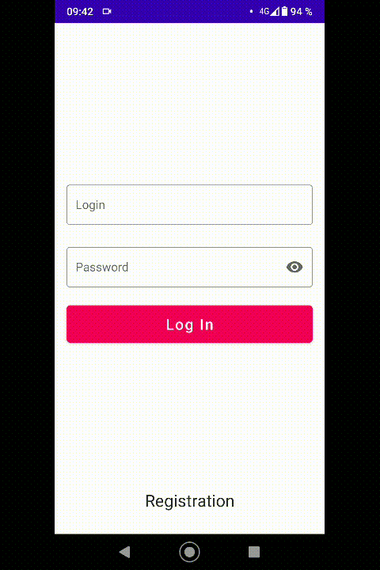

# Тестовое задание от компании Талан

### Содержание задания:

Список дел в две категории Новые и Завершённые. 
В строке заметки отображается Название, Дата/Время создания и Картинка (опционально) 
Новые сортируются по времени создания, от новых к старым. 
Завершённые сортируются по времени закрытия, от новых к старым. 

#### Должны быть реализованы функции:

- Добавить заметку
- Удалить заметку
- Отметить завершённым
- Убрать отметку
- Открыть детали заметки
- Изменить название
- Добавить описание заметки
- Добавить картинку
- Удалить картинку

Приветствуется использование архитектуры ViewBinding, RxJava и базы Room
Язык: Kotlin

<h4>Architecture</h4>

